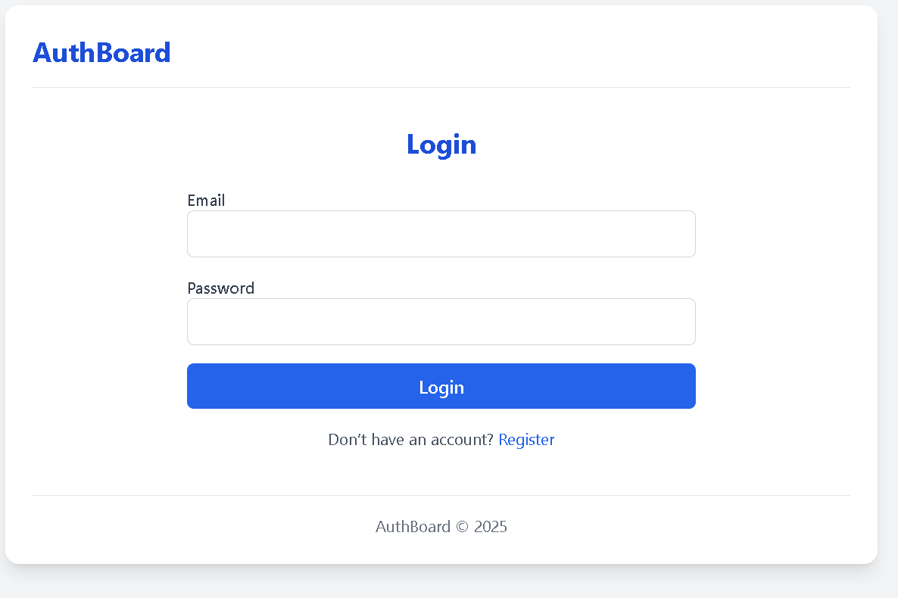
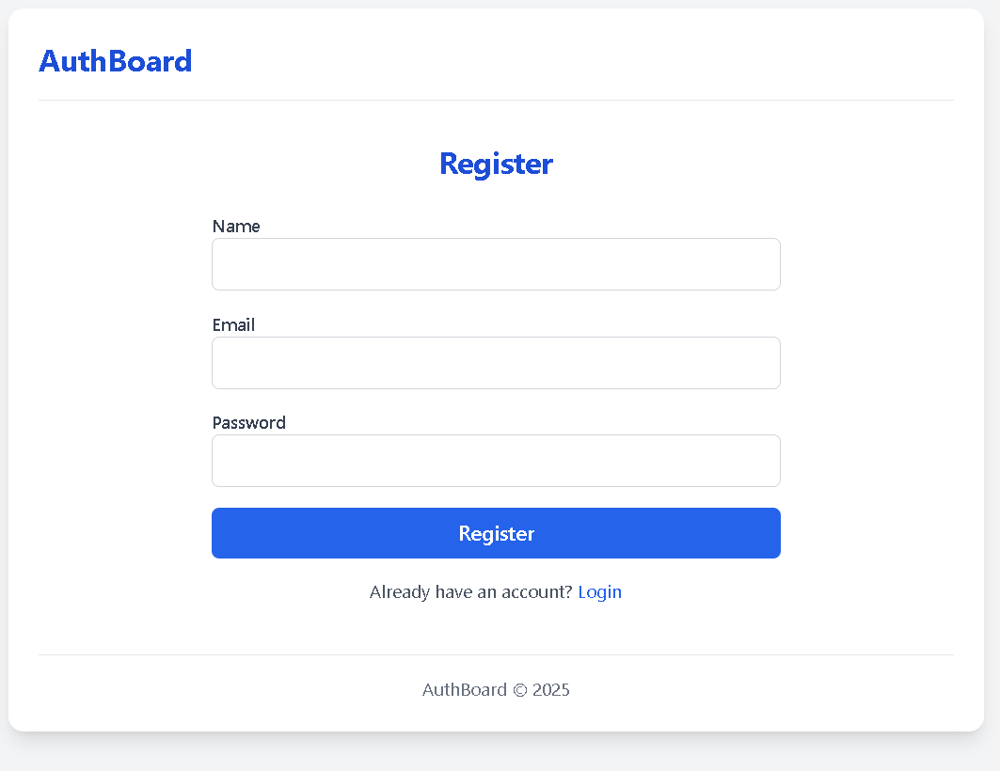
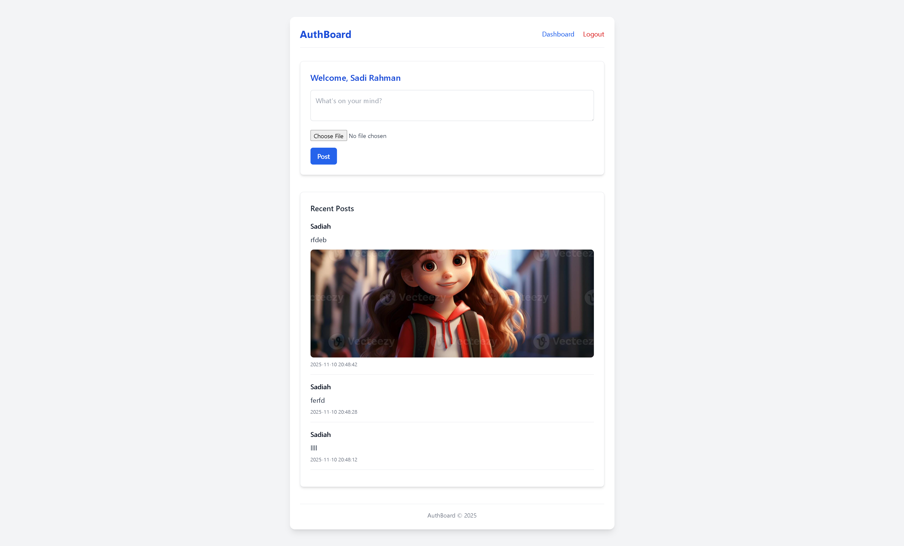

# 🏙️ Metro Dashboard App

A clean and modern **PHP MVC Dashboard Application** designed for user management and post creation.  
Built as part of a web lab project, this system demonstrates robust backend logic, modular MVC architecture, and responsive design using **Tailwind CSS**.

---

## 🚀 Introduction

The **Metro Dashboard App** is a lightweight PHP-based web system that implements a full authentication workflow and post management features without relying on heavy frameworks.  
It is ideal for learning how routing, controllers, and database operations interact in an MVC environment.

---

## ✨ Key Features

- 🔐 **User Authentication** – Secure login and registration with session handling
- 🗂️ **MVC Architecture** – Clean separation of business logic, views, and data
- 📝 **Post Management** – Create and display posts dynamically
- 🖼️ **Image Uploads** – Supports image file uploads for posts
- 🎨 **Modern UI** – Responsive interface styled with Tailwind CSS
- ⚙️ **Custom Router** – URL routing handled through a simple PHP Router class
- 🧱 **Reusable Layouts** – Common layout and components for consistent design

---

## 🧠 How It Works

1.User registers or logs in → data stored in MySQL via AuthController.

2.Router maps URLs like /login, /register, /dashboard, /post to controller methods.

3.DashboardController handles view rendering and displays posts.

4.PostController processes form submissions and image uploads.

5.Views are rendered using a reusable layout.php for consistent structure.

---

## 🛠️ Technologies Used

| **Layer**           | **Technology**              |
| ------------------- | --------------------------- |
| **Language**        | PHP 8+                      |
| **Frontend**        | HTML5, Tailwind CSS         |
| **Database**        | MySQL                       |
| **Server**          | Apache (XAMPP)              |
| **Architecture**    | MVC (Model–View–Controller) |
| **Version Control** | Git & GitHub                |

---

## 📸 Screenshots

---

## 📁 Future Enhancements

🔄 Add edit & delete options for posts

🔔 Implement notifications for user actions

🌐 Add AJAX for smoother user interactions

🧑‍💼 Add user roles (admin, editor, viewer)

---

## 👩‍💻 Author

Sadiah Chowdhury

🎓 University Web Lab Project

📧 [Mail](sadiahchowdhury23@gmail.com)

🔗 [Github Profile](https://github.com/Sadiah-Rahman)
